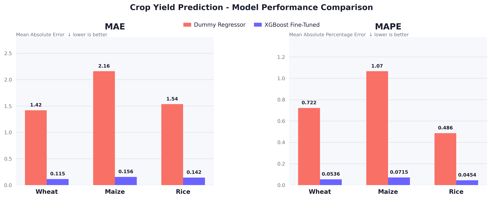
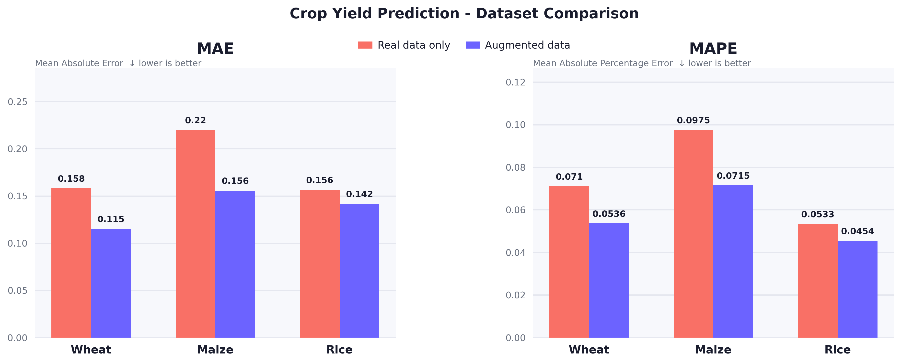
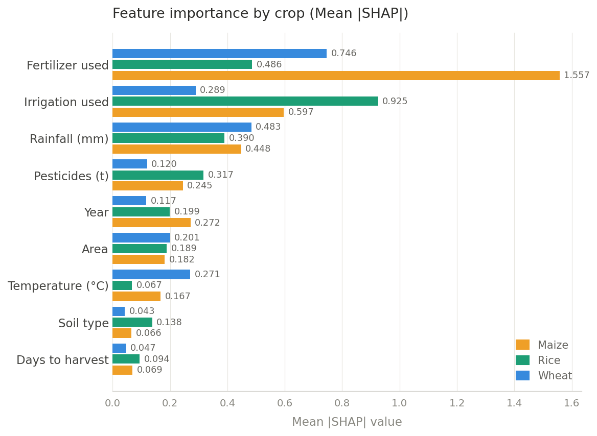
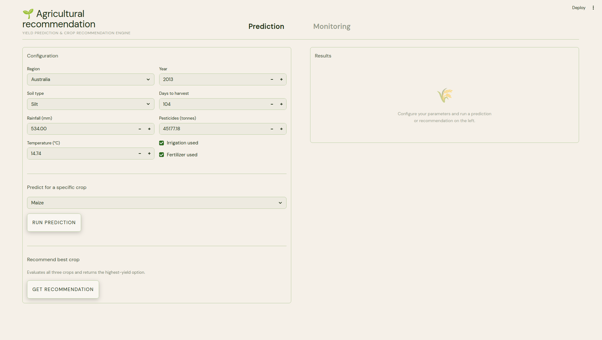
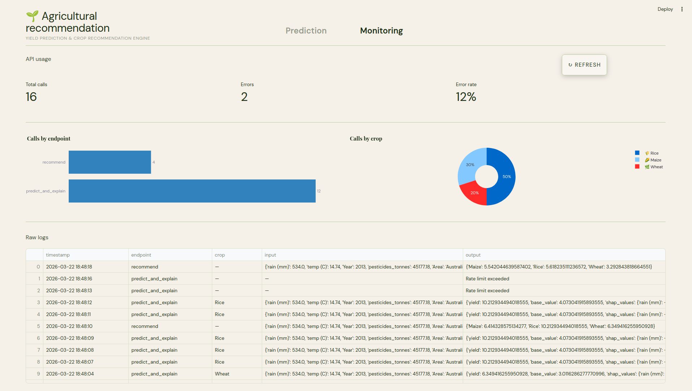

# Recommandation agricole 
Rapport de projet - 21 mars 2026

## Introduction

Le but du projet est d'apporter une assistance à des clients agriculteurs afin de prendre des décisions quant à leurs cultures. Cette assistance prend la forme d'un site internet via lequel on pourra :

- Estimer la production de son terrain en fonction des facteurs extérieurs (précipitation, température, type de sol, ...) et du type de culture.

- Recommander un type de culture spécifique en fonction des facteurs extérieurs.

La solution proposée est composée de deux composants :

1. Une API (*FastAPI*) qui gère les deux fonctions décrites ci-dessus.

2. Une interface web (*Streamlit*) qui permet aux utilisateurs d'intéragir avec l'API, et d'avoir un retour direct sur leurs choix. Dans ce PoC, nous avons aussi intégrer un onglet "Monitoring" qui permet de visualiser les statistiques de l'utilisation de l'API ainsi que les éventuelles erreurs.

## Pré-étude et entraînement

Les données disponibles et utilisées sont les suivantes :

- Mesures réelles de précipitation, de température et de type de sol. 7 colonnes pour environ 30 000 lignes.

- Données synthétiques, générées par un modèle de Deep Learning. 10 colonnes pour 1 000 000 lignes.

Nous avons utilisés les données synthétiques afin d'augmenter les mesures réelles via un matching KNN, i.e. pour chaque sample des données réelles, on recherche la ligne qui est la plus proche dans les données synthétiques.

Nous avons ensuite entraîné les modèles suivants, sur des types de cultures sélectionnées (maïs, riz et blé): 

- Dummy Regressor

- Régression lineaire

- Random Forest

- XGBoost

XGBoost est le modèle qui a été retenu de part ses performances sans optimisation.

Enfin, afin d'obtenir une meilleure performance, nous avons effectué une recherche des meilleurs hyperparamètres de XGBoost par optimisation Bayesienne.

Au final, nous avons trois modèles (correspondant au trois types de cultures) qui ont été optimisés au maximum et prêts à être utilisés en production.

## Performance des modèles

L'appréciation qualitative d'un modèle est relative, nous avons ainsi entraîné une "Dummy Regressor", qui prédit la valeur moyenne de la production de la culture. 

Ce modèle donne une mesure $R^2 = 0$ par définition, nous utiliserons donc le MAE [^1] et le MAPE [^2] comme mesures de performance.

La MAE nous permets de savoir à combien de tonnes par hectare nous sommes loin de la production moyenne de la culture. La MAPE nous permet de savoir à combien de pourcentages nous sommes loin de la production moyenne de la culture.

Lorsque nous le comparons au modèle finale utilisé en production, nous obtenons le graphique suivant :

Le modèle final XGBoost apporte véritablement une amélioration quant à la prédiction de la production par rapport au modèle Dummy Regressor.

Dans un second temps, nous avons décidé de vérifier l'utilité de l'augmentation du dataset via le matching KNN. 

Encore une fois, ce graphique nous montre une amélioration de la performance due aux données ajoutées.

## Influence de chaque colonne sur la performance

Afin de pouvoir expliquer chaque résultat, nous avons effectué une analyse des valeurs Shapley moyennes absolues globales. Les valeurs Shapley nous informe sur l'importance d'une colonne quant à la prédiction de la production.

Nous avons ainsi obtenu le graphique suivant :

Il nous indique que l'utilisation des engrais et de l'irrigation ont une grande influence sur la production, bien que cette influence soit hétérogène d'une culture à l'autre. La quantité de précipitation est très influente et constante à travers les cultures.

Afin d'avoir une idée plus précise sur la manière dont ces facteurs influencent la production, nous avons effectuer une analyse des valeurs Shapley par culture. Chaque point correspond à une prédiction faite par les modèles. Leur position sur l'axe x correspond à l'impact (négatif ou positif) de la colonne quant à la prédiction.

\begin{figure}[H]
  \centering
  \includegraphics[width=0.8\textwidth]{assets/shap_beeswarm_maize.png}
  \caption{Nuage de Shapley pour la culture de maïs}
\end{figure}

\begin{figure}[H]
  \centering
  \includegraphics[width=0.8\textwidth]{assets/shap_beeswarm_rice.png}
  \caption{Nuage de Shapley pour la culture de riz}
\end{figure}

\begin{figure}[H]
  \centering
  \includegraphics[width=0.8\textwidth]{assets/shap_beeswarm_wheat.png}
  \caption{Nuage de Shapley pour la culture de blé}
\end{figure}

Ces graphiques sont très intéressants car ils nous permettent d'anticiper l'impact d'un changement de contexte et de comprendre les leviers existants qui peuvent augmenter le rendement d'un terrain. 

Une étude supplémentaire devra être conduite afin de déterminer le résultat économique de l'opération : 

$$
\underbrace{S}_{\text{Surface (ha)}} \times 
\underbrace{\Delta R}_{\substack{\text{Rendement} \\ \text{supplémentaire (t/ha)}}} \times 
\underbrace{P}_{\text{Prix (€/t)}} - 
\underbrace{C_{\text{op}}}_{\substack{\text{Coûts} \\ \text{opération (€)}}} 
= \underbrace{\Pi}_{\text{Profit (€)}}
$$

## Mise en production et usage

Nous avons diviser l'interface web en deux parties :

- Onglet "Prédiction", c'est là où l'utilisateur peut appeler l'API et obtenir une prédiction ou une recommendation sur le type de culture conseillé.

- Onglet "Monitoring", cette partie est destinée au développeur/ingénieur data en charge du suivi de production. On peut y voir les logs des appels de l'API, les erreurs rencontrées, ainsi que quelques métriques d'analyse.

Cette interface permets à un utilisateur de tester des dizaines de configurations différentes en quelques minutes et d'avoir un retour immédiat sur chaque opération. 

Cela représente une amélioration conséquente par rapport au temps passé sur le prototypage et au temps de recherche de solutions.

## Conclusion

Cette analyse nous a permis de déterminer les leviers les plus importants pour les cultures maïs, riz et blé. 

Nous résumons ces leviers et leurs impacts dans la table suivante :

| Variable            | Maïs | Riz | Blé | Interprétation                                  |
|---------------------|:----:|:---:|:---:|-------------------------------------------------|
| Engrais utilisés    | ↑↑   | ↑   | ↑↑  | Fort impact positif, surtout maïs et blé        |
| Irrigation          | ↑    | ↑↑  | ↑   | Critique pour le riz                            |
| Précipitations (mm) | ↑    | ↑   | ↑   | Impact positif constant sur toutes les cultures |
| Pesticides (t)      | ↑    | ~   | ↑   | Impact légèrement positif sur toutes les cultures|
| Température (°C)    | ↓    | ~   | ↓   | Impact faible, hétérogène négative              |
| Zone (pays)         | ±    | ±   | ±   | Très hétérogène selon le pays                   |
| Type de sol         | ~    | ~   | ~   | Faible influence globale                        |
| Année               | ↑    | ↑   | ~   | Tendance légèrement positive                    |
| Jours avant récolte | ↑    | ↓   | ~   | Impact modéré dépendant de la culture           |

*Légende : ↑↑ fort impact positif · ↑ impact positif · ~ neutre · ↓ impact négatif · ± hétérogène*

Chaque situation étant unique, ces recommendations générales sont à précisées pour chaque terrain et contexte.

[^1]: MAE (*Mean Absolute Error*)

[^2]: MAPE (*Mean Absolute Percentage Error*)